# stepful-booking-app
A sample project for students to book a session with a coach

Going to walk through some screenshots with some design decisions that I made. 

Symfony has some nice features that I used to get the project setup. It can auto-generate some CRUD features for the Entities that are setup via command line interface. 

I started off making the Student Entity [ID (autogenerated), firstName, lastName, phoneNumber] and a simple crud page to get that data populated. I added tailwind css to get the forms looking nice. Here you can see the student management page that can edit, show, or create a new student. 
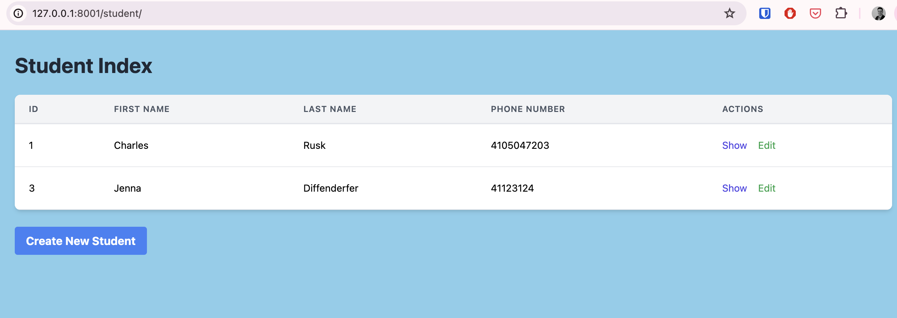

And then here is the modal that opens, with some htmx and javascript to submit a new student. I didn't add validation beyond the call failing since I made the firstName, lastName, phoneNumber NOT NULL in the database. part of the TODO at the end. 
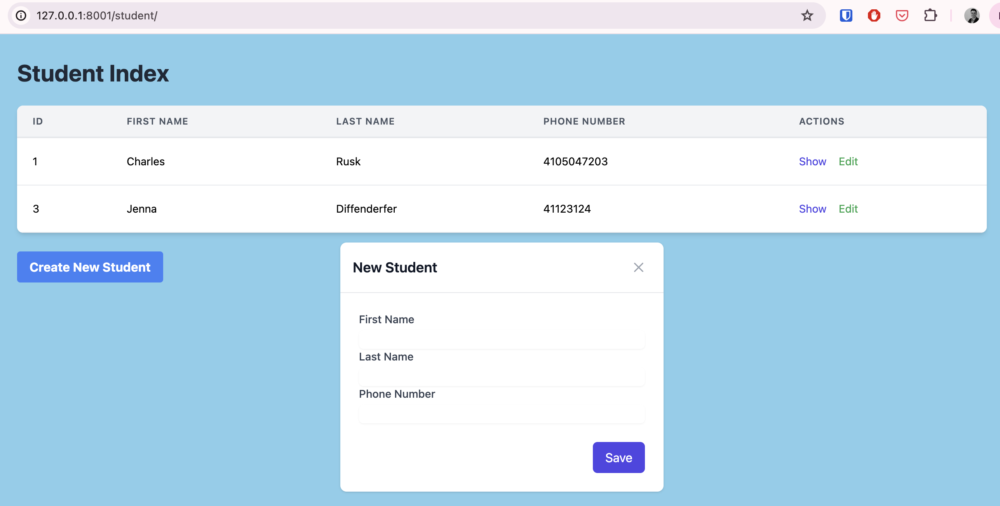

After you make a new student, you can click "show" on the management page to open the Student Details page. This would be the main "profile" view in a real-world app. You can see at the bottom of the page there is a section for "Booked Sections" and a button for "Book New Session" - more on that later. 
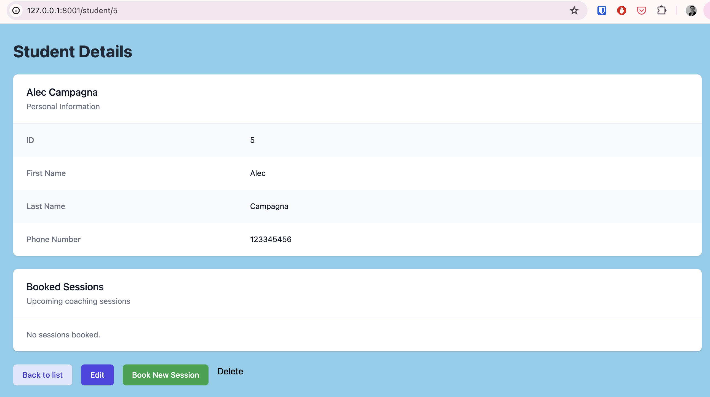

Like the student admin/management page previously seen. We have the coach admin page located at [/coach/]. Again, basic, autogenerated CRUD with tailwind to make it look good. Database entity here is [Id (autogenerated), firstName, lastName, phoneNumber].
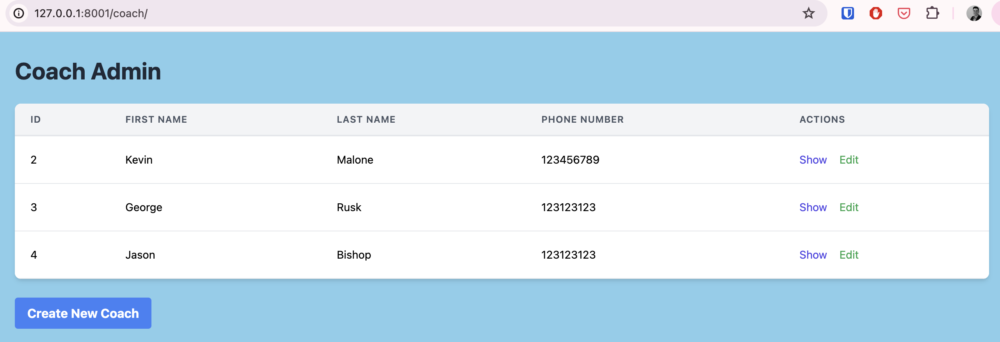

Here is the result fo the "show" button from the coach Admin page. You can see the coach's details, edit, and see open and closed sessions. 
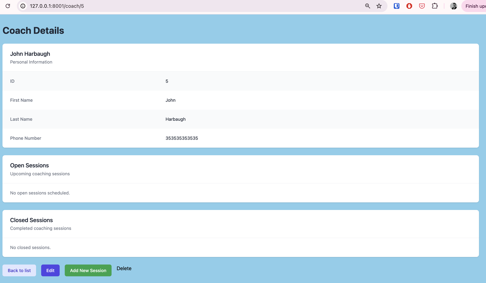

From the coach page, click on "Add New Session" and the session form will load to create a Session [Id (autogenerated), startDateTime, Coach, Student]. I made it so here, the session needed to have a Coach, but the student defaulted to NULL so it was available to be booked. Basic idea here is that the coach would be on their own profile and create a new session. Selecting a time updates the banner to show the two hour space the session will occupy. 
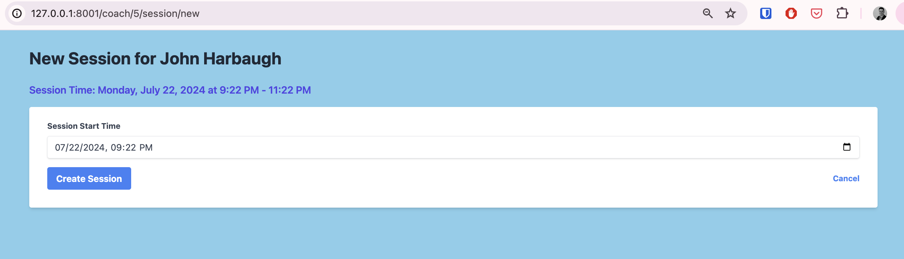

After making a couple of sessions, back on the coach details page, the open sessions area is filled in with some sessions that have not been booked, so are labeled "not booked" and you can't click on them. 
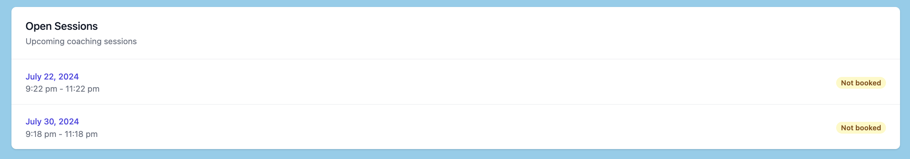

Back on the student page, you can click on the book session button and you'll be taken to a available sessions list with all of the available (not booked by another student) sessions.
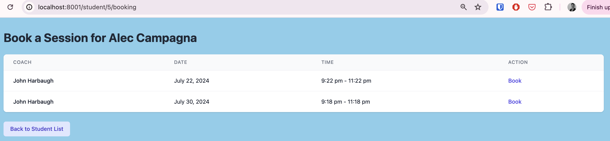
And a banner showing the session was booked.
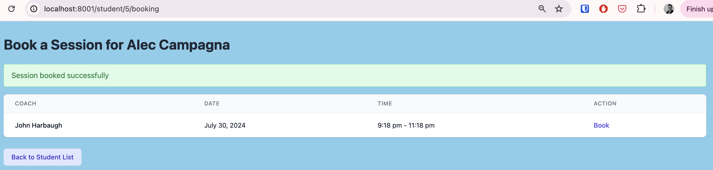

Now on the student's detail page, the sessions are on display in the Booked Sessions section, where they can now see the Session details - including the Coach's information.
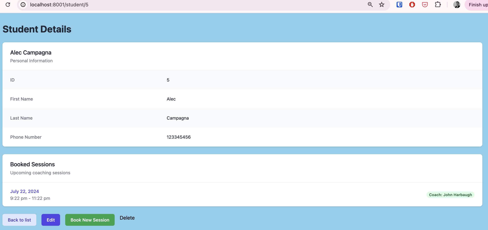

And here is the session detail from the student's end. They can see the coach's information and the time slot. 
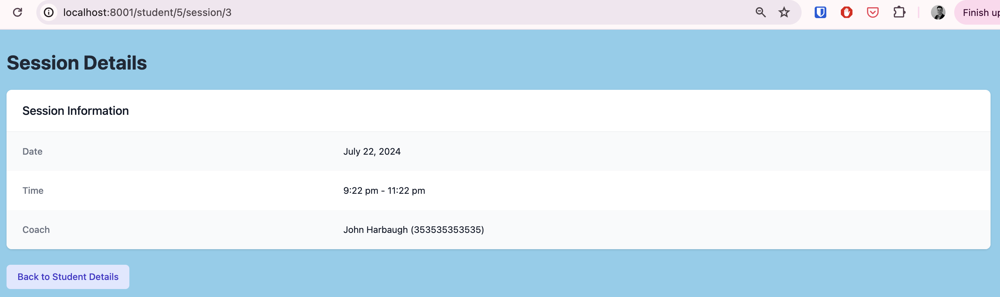

Jumping back to the coach's view - after a session is booked, the student's information is now available to the coach from the sessions section of the coach detail page.
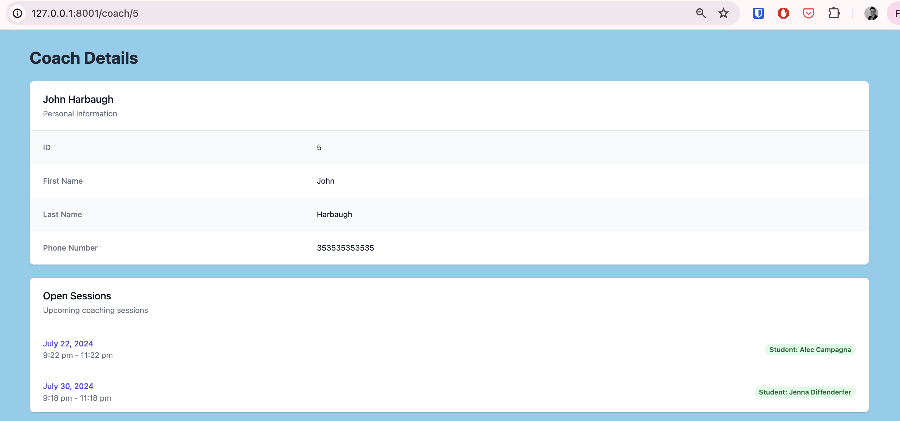

The coach, from the details page, can click on the session date to see a detailed view of the session that includes the student's information. After the session is complete, the coach, using the session detail page, can review the session (1-5), write some notes and "close" the session. 

From the database side of things, I added 3 columns to the Session [status (boolean), satisfaction (int), and notes (text)]. "Closing" the session toggles the status to false. 
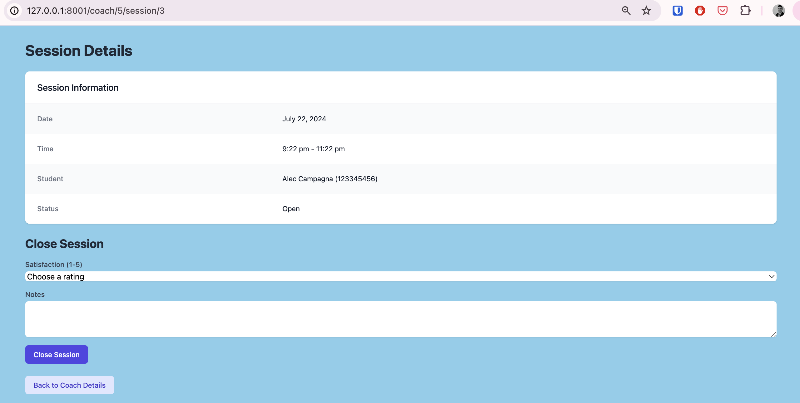

After the session is "closed" the session detail is still viewable, but not editable. 
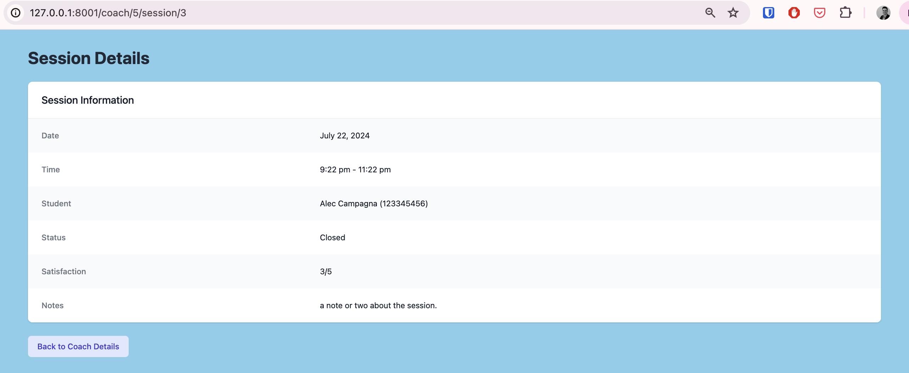

And lastly, back to the coach's detail page, I seperated out the open and closed sessions for a bit of organization. 
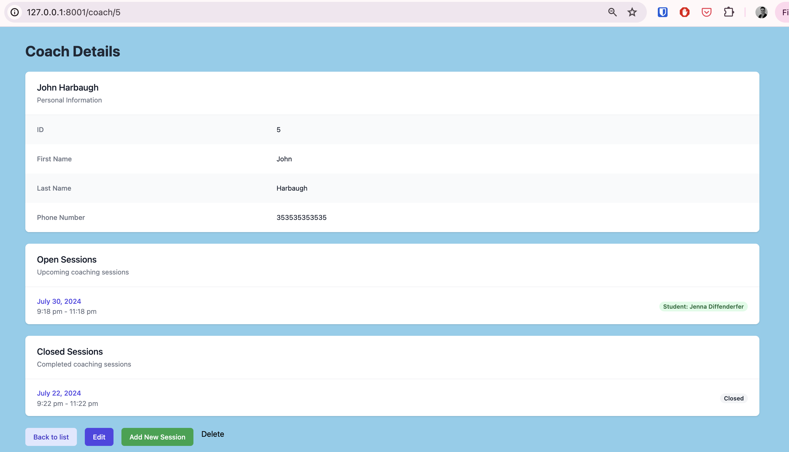

Overall I accomplished the tasks within the scope of the project with limited grace taken in regards to validation, authentication, and access. 

Coaches can view their own upcoming slots.
Students can book upcoming, available slots for any coach.
When a slot is booked, both the student and coach can view each other’s phone-number.
After they complete a call with a student, coaches will record the student’s satisfaction (an integer 1-5) and write some free-form notes.
Coaches should be able to review their past scores and notes for all of their calls.

Thanks again for the opportunity to show off my user story to prototype skills and look forward to chatting more about how I can make an impact at Stepful!